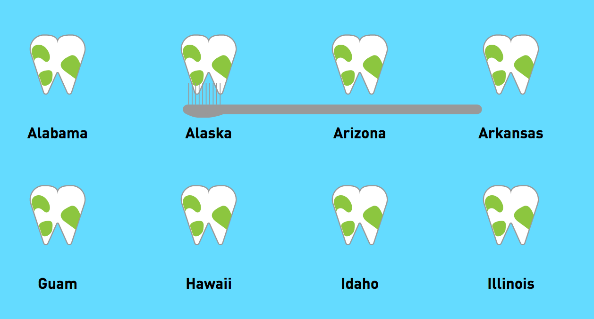

# Populatie voorzien van fluoride water & gebitsgezondheid in Amerika.

Voor dat je verder leest, open het prototype in __Firefox__ en geef het een paar seconden de tijd om te laden.

Vanuit het ontwerp hygiëne kwam ik op de twee onderwerpen 'gebitsgezondheid' en 'fluoride water' uit. Dus twee datasets. Voor beide heb ik een concept uitgewerkt en tot een interactieve website gemaakt. 

## Fluoride water
De naam zegt het al, het is fluoride(wat ook in je tandpasta zit) + water. In Amerika stoppen ze deze stof in je drinkwater. Wij Nederlanders deden dat ook van ongeveer 1960 tot 1970. We stopte met het toevoegen van fluoride aan het drinkwater toen we er achter kwamen dat het een giftige stof bleek te zijn. In de interactieve website komen ook nog een aantal weetjes aan bod (Aan de kaak).


## Onderdelen

### Fluoride voorziening op de kaart (Amerika)
In het eerste onderdeel wordt op een kaart weergegeven hoeveel procent van de Amerikaanse populatie(per staat) fluoride water binnen krijgt. Als je met je cursor over een staat gaat, wordt daar op extra informatie weergegeven. Aan de rechterkant(niet op de preview) is er keuze uit verschillende jaartallen. De cijfers veranderen dynamisch mee met het jaartal. Naast de kaart is een watertoren weergegeven. Deze geeft aan hoeveel procent van de gehele Amerikaanse populatie fluoride water binnen krijgt.


### Weetjes over fluoride
In de instalatie zitten een X hoeveelheid 'weetjes' gestopt. Door op de kraanhendel te klikken zal de installatie een volgend 'weetje' tonen. Het concept hier achter is dat je eens grondig gaat kijken naar elk druppel dat uit de kraan komt.


### Gebitsgezondheid (Amerika)
Als laatste mag jij als gebruiker lekker de staten van Amerika gaan poetsen, om zo de gemiddelde gebitsgezondheid te achterhalen. Poetsen van je tanden doe je namelijk niet in één seconden. De gebitsgezondheid is een getal van 0 t/m 100%. Hoe meer procent, hoe beter de gezondheid van het gebit is. 100% is niet normaal gezond.



---


## Over de code

In deze opdracht ben ik begonnen met het leren werken met objecten. Deze keuze heb ik gemaakt omdat als je svg vanuit illustrator exporteerd het een rommel is. De svg files heb ik in apparte html files geplaatst, opgeschoond voor gebruik en html / css / javascript gescheiden.
``` html
<object id="toothbrush" type="text/html" data="./components/"></object>
```

---

## Instructies hoe er meer bestanden ingeladen kunnen worden. (Engels)

### Set-up

#### Step 1
Open index.js

---


#### Step 2
If you are custom a custom folder, please fill in the path. (~ line 80)

``` javaScript
var pathStart = ""; // example: ./dataFiles/
```
---


#### Step 3

For writing down the file information scroll down to the variable 'allFileData'. This variable indicates which files have to be loaded and most important how that are loaded. Each file needs it's own object. **(required)**

``` javascript 
{
    // This is your new file
}
```
---


#### Step 4

Fill in your metadata. It is not yet used by the script, but it will help you keep track of your sources. Feel free to customize it.

``` javascript
metadata : {
    owner : //, creator/creators
    source : // link to the source
},
```
---

---

#### Step 5

Define how you want JavaScript to read your file. For dirty data it is recommended to use the text variant. **(required)**

Formats:(string)
* csv
* tsv
* text

And any other format that is supported by d3. (future proof)

``` javaScript
readAsType :  // "csv" / "tsv" / "text"  //
```
---

#### ~~Step 6~~

~~Define the graph you are going to use. Only the bar chart is supported. This function might change later. It might change to an array, for supporting multiple graphs. For now fill in as a string _"bar"_. **(required)**~~

---

#### Step 7

Fill in the identifier. Keep it simple, camelCase recommended. **(required)**
``` javaScript
id : // "id"
```
---

#### Step 8
It is possible to validate columns if you fill in the mustBeFilledIn object.
If you want to use this feature you have to make use of the prepareData function. Which is already located below. 

``` javascript
mustBeFilledIn : [
    "column/object key" : true // true is validate. False or not fill in is not validate
]
```

The prepareData function will clean your columns and data. Validate data and also it will simplify your columns. So for example from(column): "#this is MY column " TO "this_is_my_column"

``` javascript
prepareData(container);
```
---

#### Step 9

Now add your own filters within a few lines!

See the property: filterData
``` javascript
filterData : [
    // {} filter
    // {} filter 2
]
```

Easy filters?
``` javascript
{
    filterOn : // column
    friendlyName :  // title name (used in html)
    filterFunction : function (d) { // how do you want to filter it?
        return d[this.filterOn] === this.defaultValue; // default value will be generated
    },
}
```

Advanced filters? 
Disable the prepareFilters function and will not look for variants to generate the filter. If you have done this, you can add your fully customized filters. (the prepareFilters can be found at the end of the whole object)

``` javascript
prepareFilters (allData, container.filterData);
```
---

#### Step 10
You are done with filling the settings. Now it is time to edit which processes you need to preform in order to prepare you data.

``` javascript
var processes = [
    // function
];
```

Within the startFunction(first function that gets executed) there are the order of the processes defined. If you scroll a little bit down you can see the array with all the processes. Every process is a function which the code will execute in order. It will return the data you have edited(under variable >allData<). So you can use mutators as well as non mutators on the data.

``` javascript
processes : {
    processName1 : function (container, allData) {
        return allData;
    },
    processName2 : function (container, allData) {
        return allData;
    }
}
```


---

## licentie

* CDC. (2017, 25 oktober). Water Fluoridation Statistics - Percent of PWS population receiving fluoridated water [Dataset]. Geraadpleegd van https://chronicdata.cdc.gov/Oral-Health/Water-Fluoridation-Statistics-Percent-of-PWS-popul/8235-5d73

* CDC. (2017, 25 oktober). NOHSS Adult Indicators [Dataset]. Geraadpleegd van https://chronicdata.cdc.gov/Oral-Health/NOHSS-Adult-Indicators/jz6n-v26y
